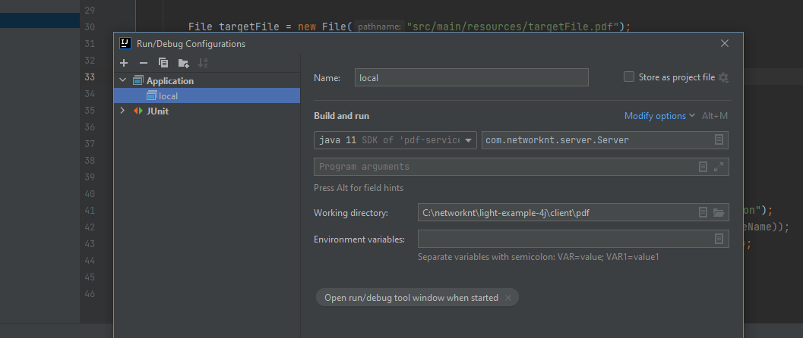
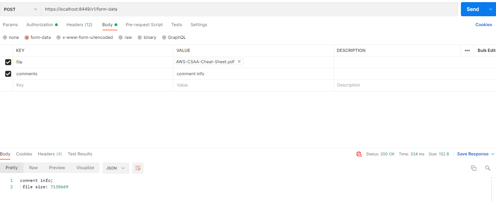

# PDF example display


## Build and verify

 ### Build and start service:


 ```
 cd ~/networknt
 git clone git@github.com:networknt/light-example-4j.git
 cd ~/networknt/light-example-4j/client/pdf

 mvn clean install

java -jar   target/pdf-service-1.00.jar

```

Or start the service API from your local IDE



 ###  verify

from POSTMAN:

 GET: https://localhost:8449/v1/pdf/report

 Download response as pdf file and verify

---

POST: https://localhost:8449/v1/form-data



The handler will get the pdf file from form and save it to local path: src/main/resources/targetFile.pdf


For the endpoint: POST https://localhost:8449/v1/pdf/report

Please refer to the  [junit test case](src/test/java/com/networknt/example/pdf/handler/PdfReportPostHandlerBufferTest.java) for detail implementation
