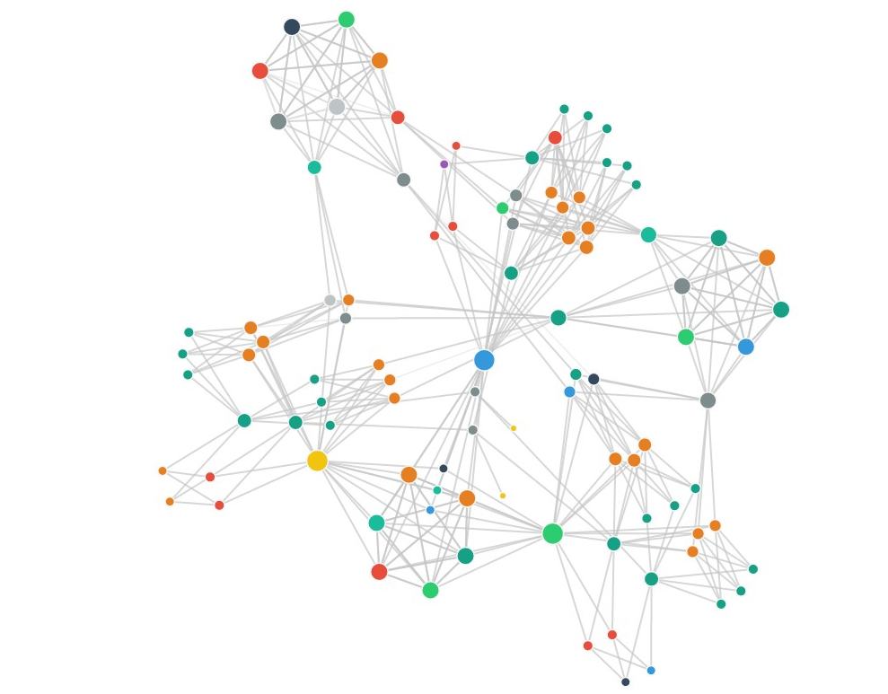
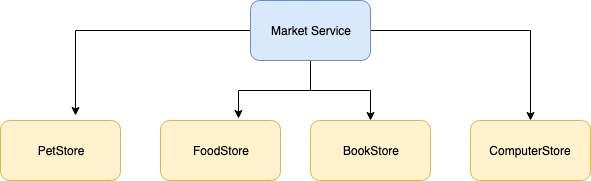

# Light-4j servicemesher client module call example

This example project used to show how to use light-4j client module and consumer component to call multi-service APIs in servicemesher environment.

It use java async concurrent feature and process the service call parallel


## Introduction:

 For microservice application, The application will be split into a set of smaller, interconnected services instead of building a single monolithic application.
 Each microservice is a small application that has its own hexagonal architecture consisting of business logic along with various adapters.
 So there will be lots service to service call to get the required data for business method.
 Microservices architecture adding a complexity to the project just by the fact that a microservices application is a distributed system.


 So massive service call need guarantee very good performance in order to complete the business logic in short time. If those service call implement synchronously that means the service calls
 will be implement one by one and any of them take long time will hangup the whole service.


 Light-4j client module and light-consumer-4j component use jave CompletableFuture asynchronous programming to implement
 non-blocking code by running a task on a separate thread than the main application thread and notifying the main thread about its progress, completion or failure;


 We will introduce the detail steps for the implementation in this project as below.





## Modules

 -- services

   Inside services folder, we build four simple server side mock service APIs:


```

| ------------------ | -------------------------------------------|------------| ----------------------|
| Service API        | Service Id                                 |  Port      |  docker image name    |
| ------------------ | -------------------------------------------|------------| ----------------------|
| petstore   API     | com.networknt.petstore-service-api-3.0.1   | 8443       | petstore-service      |
| ------------------ | -------------------------------------------|------------| ----------------------|
| bookstore API      | com.networknt.bookstore-service-api-3.0.1  | 8444       | bookstore-service     |
| ------------------ | -------------------------------------------|------------| ----------------------|
| foodstore API      | com.networknt.foodstore-service-api-3.0.1  | 8447       | foodstore-service     |
| ------------------ | -------------------------------------------|------------| ----------------------|
| computerstore API  |com.networknt.computerstore-service-api-3.0.1| 8445       | computerstore-service |
| ------------------ | -------------------------------------------|------------| ----------------------|


```

  -- client

  In client folder, we build a client service API which use light-4j client module's consumer component to call the service APIs parallel.


##  Structure diagram





##  Code implementation


### service config

Since the client side service API will call multiple services, to avoid hardcode the service id in the code, we define it in the config file.
By using the light-4j token injection feature, we set the detail value at values.yml:


`values.yml`


```yaml
#--------------------------------------------------------------------------------
# service-define.yml
#--------------------------------------------------------------------------------
service-define.serviceMap:
  petstore:
    {  serviceId: "com.networknt.petstore-service-api-3.0.1", protocol: "https",   environment: null , requestKey: null}
  bookstore:
    {  serviceId: "com.networknt.bookstore-service-api-3.0.1", protocol: "https",   environment: null , requestKey: null}
  foodstore:
    {  serviceId: "com.networknt.foodstore-service-api-3.0.1", protocol: "https",   environment: null , requestKey: null}
  computerstore:
    {  serviceId: "com.networknt.computerstore-service-api-3.0.1", protocol: "https",   environment: null , requestKey: null}


```

The service config will be convert to ServiceMapper object by Config mapping:

```
    ServiceMapper serviceMapper = (ServiceMapper) Config.getInstance().getJsonObjectConfig(ServiceMapper.CONFIG_NAME, ServiceMapper.class);
```


`ServiceMapper.java`

```java
package com.networknt.market.service;

import java.util.HashMap;
import java.util.Map;

public class ServiceMapper {
    public static final String CONFIG_NAME = "service-define";

    private Map<String, ServiceObject> serviceMap = new HashMap<>();


    public ServiceMapper() {
    }

    public Map<String, ServiceObject> getServiceMap() {
        return serviceMap;
    }

    public void setServiceMap(Map<String, ServiceObject> serviceMap) {
        this.serviceMap = serviceMap;
    }
}

```


Then in the

`MarketServiceImpl.java`

```java

public class MarketServiceImpl implements MarketService{
    private static final Logger logger = LoggerFactory.getLogger(MarketServiceImpl.class);
    private static final String PET_STORE = "petstore";
    private static final String FOOD_STORE = "foodstore";
    private static final String BOOK_STORE = "bookstore";
    private static final String COMPUTER_STORE = "computerstore";

    ServiceMapper serviceMapper = (ServiceMapper) Config.getInstance().getJsonObjectConfig(ServiceMapper.CONFIG_NAME, ServiceMapper.class);
    @Override
    public Market getMarket() throws Exception {
        Market market = new Market();
        Http2ServiceRequest listAllPets = getHttp2ServiceRequest(PET_STORE, "/v1/pets", "GET");
        Http2ServiceRequest listAllFood = getHttp2ServiceRequest(FOOD_STORE, "/v1/food", "GET");
        Http2ServiceRequest listAllComputers = getHttp2ServiceRequest(COMPUTER_STORE, "/v1/computers", "GET");
        Http2ServiceRequest listAllBooks = getHttp2ServiceRequest(BOOK_STORE, "/v1/books", "GET");

        CompletableFuture<List> petsFutureResponse = listAllPets.callForTypedObject(List.class);
        CompletableFuture<List> foodFutureResponse = listAllFood.callForTypedObject(List.class);
        CompletableFuture<List> computersFutureResponse = listAllComputers.callForTypedObject(List.class);
        CompletableFuture<List> booksFutureResponse = listAllBooks.callForTypedObject(List.class);

        Collection<CompletableFuture<?>> completableFutures = new HashSet<>();
        completableFutures.add(petsFutureResponse);
        completableFutures.add(foodFutureResponse);
        completableFutures.add(computersFutureResponse);
        completableFutures.add(booksFutureResponse);
        completableFutures.addAll(mapToMarket(market, petsFutureResponse, foodFutureResponse, computersFutureResponse, booksFutureResponse));
        try {
            CompletableFuture.allOf(completableFutures.toArray(new CompletableFuture[0])).get(3, TimeUnit.SECONDS);
        } catch(Exception e) {
            logger.error("Some information was unavailable when assembling the market value.", e);
            System.out.println("error:" + e);
            throw new ApiException(new Status("ERR10010"));
        }
        return market;
    }


    public  Collection<CompletableFuture<?>> mapToMarket(Market market,CompletableFuture<List> petsFutureResponse, CompletableFuture<List> foodFutureResponse,
                                                              CompletableFuture<List> computersFutureResponse,CompletableFuture<List> booksFutureResponse) {
        Collection<CompletableFuture<?>> completableFutures = new HashSet<>();

        CompletableFuture<Void> setPets = petsFutureResponse.thenAccept(pets -> market.setPets(pets));
        CompletableFuture<Void> setFood = foodFutureResponse.thenAccept(food -> market.setFoodbox(food));
        CompletableFuture<Void> setBooks = booksFutureResponse.thenAccept(books -> market.setBooks(books));
        CompletableFuture<Void> setComputers = computersFutureResponse.thenAccept(computers -> market.setComputers(computers));

        completableFutures.add(setPets);
        completableFutures.add(setFood);
        completableFutures.add(setBooks);
        completableFutures.add(setComputers);
        return completableFutures;
    }

    private Http2ServiceRequest getHttp2ServiceRequest(String serviceName, String path, String method) throws Exception {
        ServiceObject serviceObject = serviceMapper.getServiceMap().get(serviceName);
        ServiceDef serviceDef = new ServiceDef(serviceObject.getProtocol(), serviceObject.getServiceId(), serviceObject.getEnvironment(), serviceObject.getRequestKey());

        if (serviceDef==null) throw new Exception("There is no service config in the service-define.yml file.");
        return  new Http2ServiceRequest(serviceDef, path, HttpVerb.valueOf(method));

    }
}

```

The `getHttp2ServiceRequest` method will get `Http2ServiceRequest` light-consumer-4j component based on service define.
The `Http2ServiceRequest` class provides an abstraction for making parallel HTTP calls.

And we will send multi-service APIs call request parallel asynchronously which will return CompletableFuture.
This will can make sure system won't wait for each service call one by one.


Next step application add the return futures and result process futures to a collection of CompletableFuture. All independent futures run in parallel and system set to return it less than 3 seconds (it is configurable based on the config value:  in client.yml file ).

```
CompletableFuture.allOf(completableFutures.toArray(new CompletableFuture[0])).get(3, TimeUnit.SECONDS);

```

You can specify the JSON response type based on what class you expect it to deserialize to by calling

```java
CompletableFuture<Pet> petFutureResponse = request.callForTypedObject(Pet.class);

CompletableFuture<List<Pet>> petListFutureResponse = request.callForTypedList(Pet.class);
```

If you do not have a class definition for the response, you can use a generic Map:

```java
CompletableFuture<Map> futureResponse = request.callForTypedObject(Map.class);
```

The response received from making a request can be held in a [CompletableFuture](https://docs.oracle.com/javase/8/docs/api/java/util/concurrent/CompletableFuture.html),
which allows for further asynchronous chaining of operations. They will be asynchronous with respect to the original thread because a different thread was already assigned
to execute the HTTP request and wait for its response, so either that thread or an additional thread will be responsible for completing each chained operation.


Additional references to the Java 8 CompletableFuture API:
- [Guide to CompletableFuture](https://www.baeldung.com/java-completablefuture)
- [Java 8: Definitive guide to CompletableFuture](https://www.nurkiewicz.com/2013/05/java-8-definitive-guide-to.html)
- [When to use non-async methods of CompletableFuture?](https://stackoverflow.com/q/49649298)


## Build and verify

 ### Build and start server side services:

 Step 1 (build server side services and start local consul):

 ```
 cd ~/networknt
 git clone git@github.com:networknt/light-example-4j.git
 cd ~/networknt/light-example-4j/servicemesher/services

 mvn clean install -Prelease

 docker-compose -f docker-compose-consul.yml up

 ```

  Step 2 (start server side services by open new terminal):

   ```
    cd ~/networknt/light-example-4j/servicemesher/services
   docker-compose  up

   ```

 ### Build and start client side service:

  ```
  cd ~/networknt
  git clone git@github.com:networknt/light-example-4j.git
  cd ~/networknt/light-example-4j/servicemesher/client

  mvn clean install -Prelease

  docker-compose  up

  ```

  ### verify service:

  From browser or Postman (GET):

   ```
     https://localhost:8448/v1/market

   ```

   The client side service will call all four server side services parallel and get the result to build a market object. The sample result will looks like below:

    ```
     {
         "name": "name": "light-4j sample market",
         "pets": [
             {
                 "id": 1,
                 "name": "catten",
                 "tag": "cat"
             },
             {
                 "id": 2,
                 "name": "doggy",
                 "tag": "dog"
             }
         ],
         "books": [
             {
                 "id": 1,
                 "name": "Educated",
                 "author": "James Bond"
             },
             {
                 "id": 2,
                 "name": "The Amazon Job",
                 "author": "Randy Grieser"
             }
         ],
         "foodbox": [
             {
                 "id": 1,
                 "name": "Noodle",
                 "tag": "food"
             },
             {
                 "id": 2,
                 "name": "Rice",
                 "tag": "food"
             }
         ],
         "computers": [
             {
                 "id": 1,
                 "brand": "HP",
                 "tag": "1112222-22"
             },
             {
                 "id": 2,
                 "brand": "IBM",
                 "tag": "111122255-55"
             }
         ]
     }

     ```